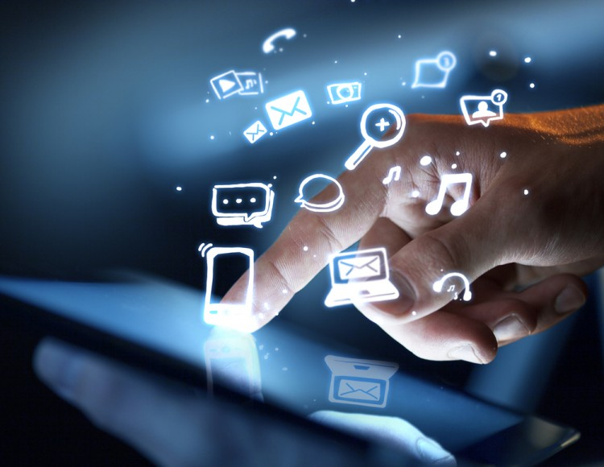

# Phone: advantages and disadvantages

Mobile phones are an essential part of everyone’s life today. It is the best technology to stay connected with the rest of the world, your loved ones, your office, and your colleagues. But, as we all know, nothing in this world has only benefits attached to it, the same is the case with mobile phones. It also has some disadvantages attached to it.

